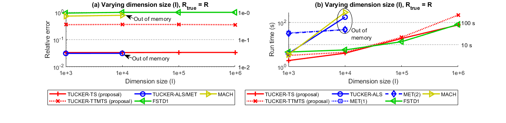

# Tucker-TensorSketch
Matlab functions for low-rank Tucker decomposition of tensors using TensorSketch.

## Some further details
Tucker-TensorSketch provides two functions, **tucker_ts** and **tucker_ttmts**, for low-rank Tucker decomposition of tensors. Both functions are variants of the standard alternating least-squares algorithm (higher-order orthogonal iteration) for the Tucker decomposition. They both incorporate a sketching technique called TensorSketch, which is a form of CountSketch that can be applied efficiently to matrices that are Kronecker products of smaller matrices. Due to the properties of TensorSketch, our functions only require a single pass of the input tensor. They can handle streamed data in the sense that they can read tensor elements in any order, and do not need to have access to all elements at the same time.

The figure below shows an experiment where we compare our functions to other competing methods. The experiment is done for sparse 3-way tensors each containing about 1e+6 nonzero elements. All sides of each tensor are of equal length. The plots show how the relative error (in subplot (a)) and run time (in subplot (b)) vary as the size of the tensor sides is increased. Our functions are fast and can handle larger tensors than competing methods, while still maintaining good accuracy.

However, our functions do not scale well with the target rank, which is why we recommend using them for *low-rank* decompositions only.

For more details, please see our which is forthcoming. Once it is available, a link to it will be added here.

## Requirements
This code requires Tensor Toolbox version 2.6 by Bader, Kolda and others (available at http://www.sandia.gov/~tgkolda/TensorToolbox/).

## Installation
Run the file **compile_all_mex.m** inside the folder help_functions. Alternatively, simply compile each c file individually by running "mex filename.c" inside Matlab.

## Demo files
The three demo files demonstrate our functions. Below is a brief description of each.
* **Demo 1:** This scrips gives a demo of tucker_ts and tucker_ttmts decomposing a sparse tensor. The script generates a sparse tensor and then decomposes it using both tucker_ts and tucker_ttmts, as well as tucker_als from Tensor Toolbox.
* **Demo 2:** This script gives a demo of tucker_ts and tucker_ttmts decomposing a dense tensor. The script generates a dense tensor and then decomposes it using both tucker_ts and tucker_ttmts, as well as tucker_als from Tensor Toolbox.
* **Demo 3:** This script gives a demo of tucker_ts and tucker_ttmts decomposing a dense tensor which is stored in a mat file on the hard drive. The result is compared to that produced by tucker_als in Tensor Toolbox applied to the same tensor stored in memory.

## Author contact information
Please feel free to contact me at any time if you have any questions or would like to provide feedback on this code or our paper. I can be reached at osman.malik@colorado.edu.